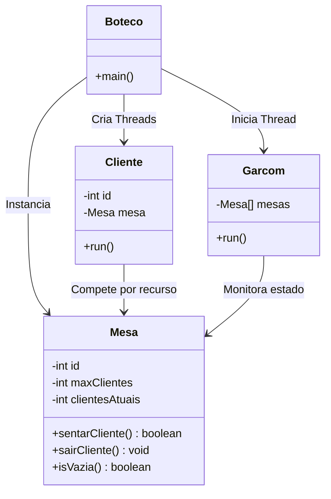

# Simulação de semáforos - mesa de bar 🍺


> Simulação de um bar utilizando **Threads** e **Monitores** para demonstrar problemas clássicos de concorrência e gerenciamento de recursos compartilhados.

## Sobre o Projeto

Este projeto foi desenvolvido de forma interdisciplinar para as matérias de **Programação Orientada a Objetos (POO)** e **Sistemas Operacionais 1 (SO)**.

O objetivo principal é simular o funcionamento de um "Boteco" onde múltiplos clientes (Threads) competem por recursos limitados (Mesas), enquanto um garçom monitora o ambiente. O sistema resolve conflitos de acesso à região crítica utilizando métodos sincronizados (`synchronized`), prevenindo condições de corrida (*Race Conditions*).

## Conceitos Técnicos Aplicados

* **Multithreading:** Execução paralela de múltiplos clientes e do garçom.
* **Região Crítica:** O acesso às cadeiras de uma mesa é controlado para evitar que mais clientes se sentem do que a capacidade permite.
* **Monitores (Java Synchronized):** Controle de exclusão mútua implementado na classe `Mesa`.
* **Starvation & Retry Logic:** Clientes tentam sentar um número limitado de vezes antes de desistirem.

## Arquitetura e Classes

A solução foi modelada com as seguintes responsabilidades:



## Como executar

## Pré-requisitos

* Java JDK instalado.

## 1. Clone o repositório
```bash
    git clone https://github.com/Hyocas/simulacao-semaforos.git
``` 

## 2. Compile os arquivos
```bash
    javac *.java
``` 

## 3. Execute a simulação
```bash
    java Boteco
```

## Membros da Equipe

* [Gabriel Mendonça]
* [Jeanluca Caleare]
* [Leandro Balbino]
* [Yago Armand]
